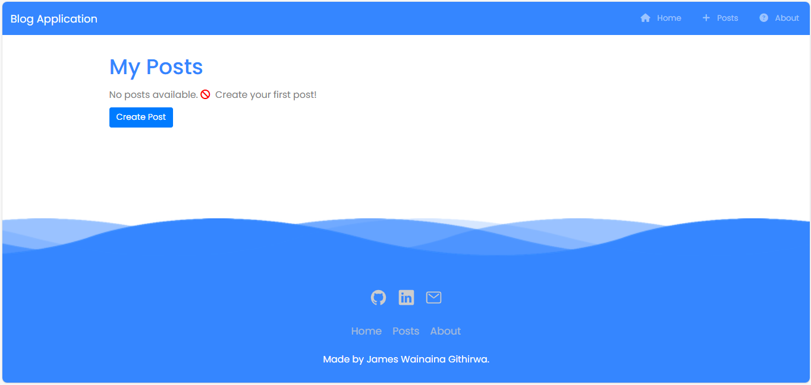
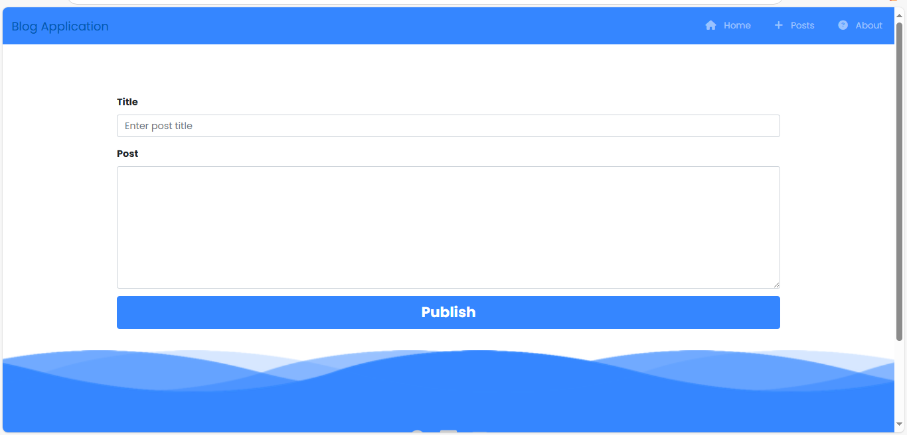
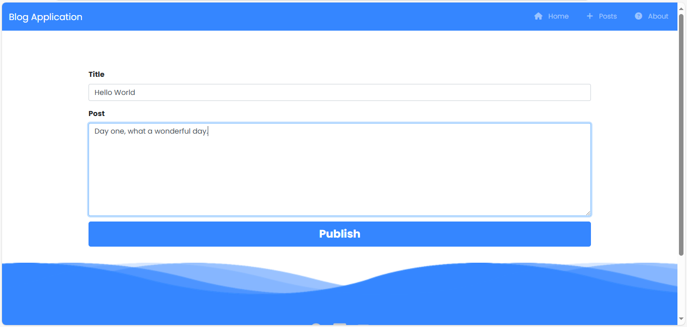
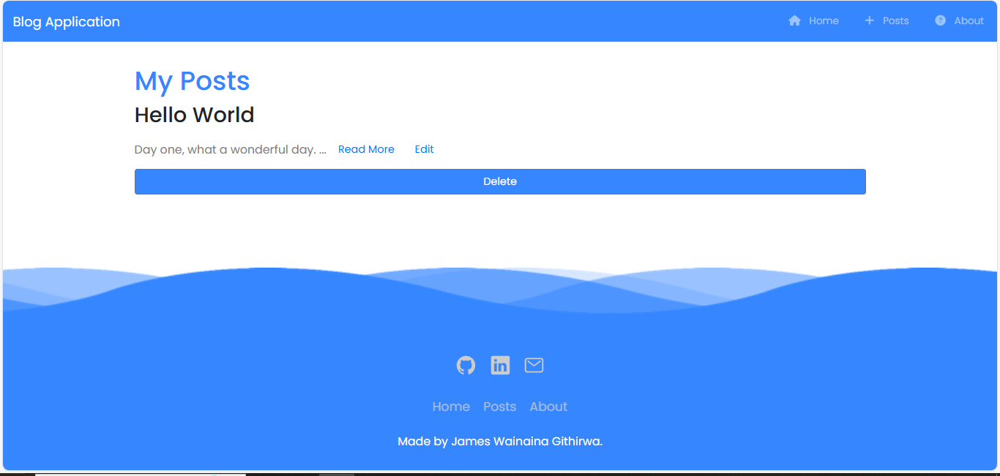
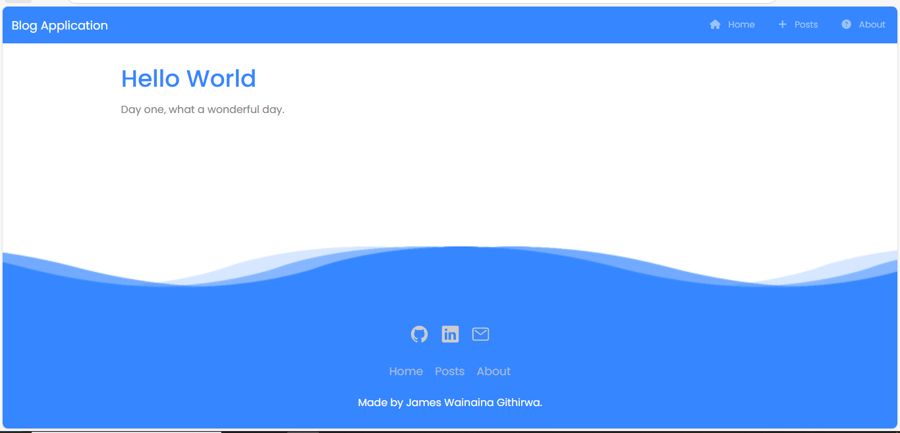
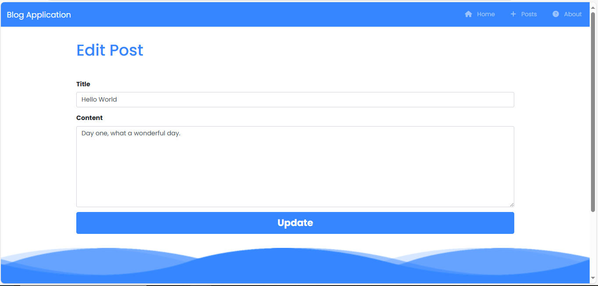

# Blog Application

## Table of Contents
- [Overview](#overview)
- [Features](#features)
- [Technologies Used](#technologies-used)
- [Installation and Setup](#installation-and-setup)
- [Usage](#usage)
- [Folder Structure](#folder-structure)
- [Future Improvements](#future-improvements)
- [License](#license)

---

## Overview
This is a **Blog Web Application** created using **Node.js**, **Express.js**, and **EJS**. 

It allows users to:
- Create new blog posts.
- View existing blog posts.
- Edit existing blog posts.
- Delete existing blog posts.

Please note that this is a basic version of the application where:
- Posts do not persist between sessions since no database is integrated.
- Styling is done using **Bootstrap** and **custom CSS** to enhance the user experience.

---

## Demo
- To Create a post, click "Create Post" button or click at the nav link "Posts", a user friendly form for creating the post will be displayed.

- Fill in the post details then click "Publish".

- Blog posts are dynamically rendered using EJS.

- To read the post click "Read More".

- To edit the post click "Edit".

- Edit the post then click "Update".
- To delete a post click "Delete and it will be deleted".
- More and more posts can be added. However, the posts don't persist as a database has not been configured.
- Responsive design has been to ensure the application looks great on any device.

---

## Technologies Used
- **Backend**: Node.js, Express.js
- **Frontend**: EJS (Embedded JavaScript), Bootstrap, Custom CSS
- **Tools**: npm, Express Router

---

## Installation and Setup
Follow these steps to set up the project locally:

1. **Clone the repository**:
   ```bash
   git clone <repository-url>
   cd <repository-folder>
